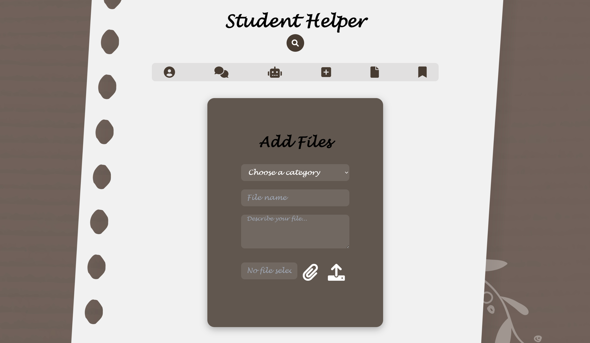
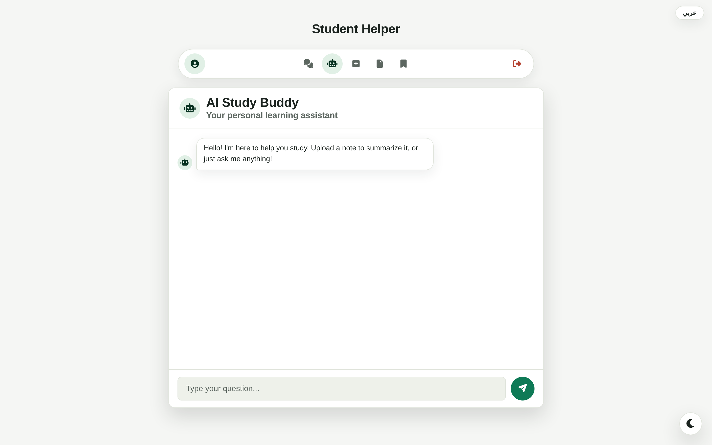
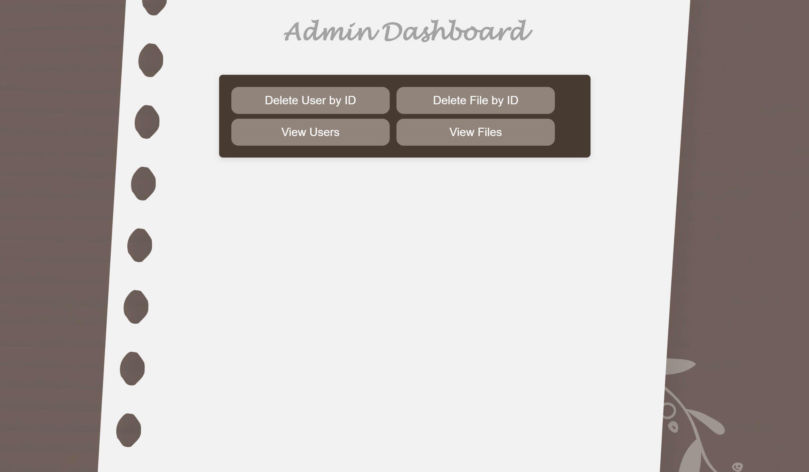

# Student Helper

A study-file sharing platform for students. Upload your notes, find what
classmates have shared, discuss a file in its own thread, message people
directly — and let AI summarise a PDF, turn it into a quiz, or answer questions
about it.

Bilingual (English / العربية) with full right-to-left support, and a dark theme.

## Features

**Files**
- Upload PDFs, images, Word documents and archives, organised by category
- Create a new category while uploading, rather than being stuck with a list
- Read PDFs in the browser; no download required
- Favourite anything you want to find again

**Finding things**
- Search that matches meaning, not just spelling. `physics` finds a file
  titled `ملخص الفيزياء`; `thermodyanmics` still finds the thermodynamics
  notes; `how do plants make food` finds a file called `Photosynthesis` that
  shares no word with the query
- Rare words outrank common ones, so `thermodynamics notes` ranks the right
  file above everything else merely called "notes"

**AI (optional — needs a Gemini key)**
- Summarise any uploaded PDF
- Generate a quiz or flashcards from a file's actual contents
- A study-buddy chat
- Topic suggestions based on what you have uploaded

**Talking to people**
- A comment thread attached to each file
- Direct messages between students

**Accounts**
- Username and password, or Sign in with Google
- An admin dashboard for managing users and content

## Screenshots

| Add a file | Files shared with me |
|---|---|
|  |  |

| AI Study Buddy | Admin dashboard |
|---|---|
|  |  |

## Tech stack

| Layer | What |
|---|---|
| Runtime | Node.js 20+ (ES modules) |
| Server | Express 4 |
| Database | MySQL 8 / MariaDB 10.5+, or any MySQL-compatible service (TiDB Cloud, PlanetScale, Aiven) |
| Front end | Vanilla JavaScript, Tailwind (CDN), a hand-written design system in `public/css/design-system.css` |
| Auth | `express-session` with a database-backed store, bcrypt, Passport for Google OAuth |
| AI | Google Gemini via `@google/genai` — chat, summaries, quizzes, and embeddings for search |
| Tests | Vitest + supertest — 292 tests across 26 files |

## Quick start

**You need:** Node.js 20 or newer, and a MySQL or MariaDB server.

```bash
git clone https://github.com/abdulazizallaqs/student-helper-app.git
cd student-helper-app
npm install
```

**1. Create the database and its tables**

```bash
mysql -u root -p -e "CREATE DATABASE Student_Helper2_DB CHARACTER SET utf8mb4"
mysql -u root -p Student_Helper2_DB < tests/setup/schema.sql
```

`tests/setup/schema.sql` is the full schema — it is named for the test suite
because that is what keeps it honest, but it is the same set of tables the app
uses. Tables for file storage, search vectors and sessions create themselves on
first boot.

**2. Configure it**

```bash
cp .env.example .env
```

Open `.env` and set at minimum `DB_USER`, `DB_PASSWORD`, `DB_NAME`, and a real
`SESSION_SECRET`:

```bash
node -e "console.log(require('crypto').randomBytes(48).toString('hex'))"
```

Everything else has a working default. `.env.example` explains each setting.

**3. Create an admin account**

```bash
npm run seed:admin                                # creates admin / admin
node scripts/setAdminPassword.js "a strong one"   # then change it
```

The server refuses to start in production while the admin password is still
`admin`.

**4. Run it**

```bash
npm run dev        # with auto-reload
# or
npm start
```

Open http://localhost:3002

**Something not working?** `npm run diagnose` checks the database connection,
the schema, the stored files and the configuration, and tells you what to fix.

## Configuration

Every setting lives in `.env`, and `.env.example` documents all of them. The
ones that matter most:

| Variable | Default | What it does |
|---|---|---|
| `DB_HOST` `DB_PORT` `DB_USER` `DB_PASSWORD` `DB_NAME` | localhost:3306 | Database connection |
| `DB_SSL` | off | Set to `true` for any hosted database — they all require TLS |
| `SESSION_SECRET` | — | Required. The app refuses to start in production without a real one |
| `FILE_STORAGE` | `disk` | `disk` keeps uploads in `public/uploads/`. `database` stores them in the database, in chunks — required on any host whose filesystem is wiped between deploys |
| `SESSION_STORE` | database | Sessions survive a restart. Set to `memory` to fall back |
| `GEMINI_API_KEY` | — | Optional. Without it the AI features report themselves as switched off |
| `GOOGLE_CLIENT_ID` / `GOOGLE_CLIENT_SECRET` | — | Optional. Without them the Google button hides itself |
| `SEARCH_EMBEDDINGS` | auto | Set to `off` to use keyword search only |

## Commands

| Command | What it does |
|---|---|
| `npm start` | Run the server |
| `npm run dev` | Run with auto-reload |
| `npm test` | The full test suite |
| `npm run test:unit` / `test:integration` | One half of it |
| `npm run diagnose` | Check the database, schema, stored files and config |
| `npm run db:repair` | Reconcile an existing database with what the code expects |
| `npm run seed:admin` | Create the initial admin account |
| `npm run admin:password` | Set or reset the admin password |
| `npm run search:index` | Build the semantic search index (run once after upgrading) |
| `npm run ai:check` | Test the Gemini key end to end |
| `npm run ai:net` | Diagnose network or proxy problems reaching Google |
| `npm run google:check` | Explain exactly why the Google button is or is not showing |

## Testing

```bash
npm test
```

292 tests across 26 files. The integration tests run against a real database —
they create an isolated `<your db>_test` schema, so your development data is
never touched.

Tests cover authentication and sessions, access control and file ownership,
uploads and file serving, the chat and messaging tables, the admin endpoints,
AI error handling and quota behaviour, all four search layers, and the
deployment configuration itself.

## Deploying

**[DEPLOYMENT.md](DEPLOYMENT.md)** has the full walkthrough, including a
free-tier option that costs nothing and a hardening checklist.

The short version: set `FILE_STORAGE=database`, `DB_SSL=true` and a real
`SESSION_SECRET`, point the health check at `/healthz`, and set the admin
password before the first production boot.

A `Dockerfile` and a `render.yaml` are in the repo, so most platforms can build
this without any configuration from you.

## Project structure

```
app.js                  Express setup, security headers, route mounting
config/                 Google OAuth, shared route constants
controllers/            Request handlers
models/                 Database access — one file per table
  db.js                 The connection pool (TLS, keepalive, charset)
  FileBlob.js           Uploaded bytes, when stored in the database
  SessionStore.js       The session store
services/
  aiService.js          Gemini: chat, summaries, quizzes, error handling
  searchService.js      Ranking: normalisation, synonyms, typos, IDF
  embeddingService.js   Vectors for match-by-meaning
  fileStorage.js        Disk or database — the rest of the app does not care
  searchIndexer.js      Keeps the search index current
middleware/             Auth guards, validation, rate limits, CSRF, errors
routes/                 URL definitions
public/
  views/                The pages (19 of them)
  js/                   Front-end modules — cards, i18n, search, AI, theme
  css/design-system.css Tokens and components, light and dark
  uploads/              Uploaded files, when FILE_STORAGE=disk
scripts/                Diagnostics and one-off maintenance
tests/                  Unit and integration suites, plus the schema
```

## Security

Read `DEPLOYMENT.md` before putting this on the internet. In short:

- Set a real `SESSION_SECRET`, and never change it after launch — a new value
  signs everybody out
- Change the admin password (`admin/admin` is the first thing anyone tries;
  the server refuses to start in production while it is unchanged)
- Serve over HTTPS. Session cookies are marked `secure` in production
- Never commit `.env` — it is in `.gitignore`, and `.env.example` is the file
  that belongs in the repository

## License

ISC.
